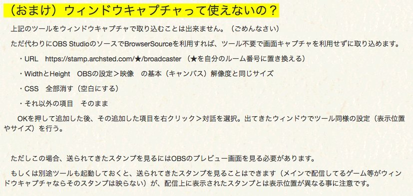

# 配信者向け情報

## 対応環境と条件

- Windows 7 以降を使っていること

**Windows7でAeroを無効にしている方は、ツールを利用したスタンプ表示ができません**。別途OBS Studioやブラウザを利用する必要があります。（後述）

!!! Note
    厳密に言えばMacやLinux用のアプリを用意する事は可能なのですが、PeerCast配信者の多くはWindowsなので、現時点ではサポート外とします。

## 利用するまで

### 会員登録

元々が３日間だけのイベント用に作ったシステムなので、多くの人に気楽に利用してもらうため、メールアドレスの入力を省いた経緯があります。その結果、パスワードを忘れた時の再発行ができません。

パスワードは忘れないように注意し、万が一忘れてしまったら再度作成し直してもらうしかありません。ご注意ください。

!!! Warning
    パスワードをリセットして欲しいという問い合わせをいただいても、本人確認の難しさから対応が難しい場合があります。予めご了承ください。

### ルーム作成

スタンプを送信してもらうためにリスナーに通知するページになります。ここの設定項目はあとから好きなタイミングで修正できます。

ログインした状態で自分のルームにアクセスすると、スタンプを削除したり、迷惑なユーザーをブラックリストに追加することができます。

## スタンプ表示

リスナーが送信してきたスタンプを表示するにはいくつかの方法があります。スタンプの取り込み方法との組み合わせによっては、利用できないものもあるのでご注意ください。

### ツール利用＋画面キャプチャ（推奨）

!!! Warning
    この方法は、以下のような方は**ご利用になれません。**
    
    - Windows 7でAeroを無効にしている  
    - メインの取り込みをウィンドウキャプチャかゲームキャプチャで行っている

メインとなる配信内容の取り込みを「画面キャプチャ」で行っている場合におすすめします。

スタンプキャストのツールは現時点でウィンドウキャプチャが利用出来ません。このため、メインの取り込みをウィンドウキャプチャやゲームキャプチャで行っている人はご利用になれません。

スタンプキャストのサイト上で配布しているツールを利用し、メインの取り込み部分に被せるようにスタンプ領域を設定します。

### OBS StudioのBrowserSourceを利用する

ツールを利用せず、OBS StudioのBrowserSourceを利用する方法です。こちらは上記の手段が取れない人でも利用できます。

また（ゲーム画面に集中したいので）スタンプを被せたくはないが、配信される（リスナーが見ている）動画にはゲーム画面とスタンプ表示を被せたい、という場合にも向いています。但し、OBS Studioのプレビューを見ないとどんなスタンプが送られてきているのかがわかりません。

以下を参考に設定してください

### 任意のブラウザ上で受信ページを直接開く

OBS Studioは使っていない。または、スタンプは画面の一部分にのみ表示するだけで何かに重ねて表示はしない時に利用する方法です。

ChromeかFirefoxで以下のページにアクセスし、画面を取り込みます。★の部分は自分のルーム番号に置き換えてください。

https://stamp.archsted.com/★/broadcaster

アクセス後にブラウザのウィンドウサイズを変えると正常に動作しなくなる、レイアウトが崩れるといった可能性があります。

ブラウザをウィンドウキャプチャしたい場合、ブラウザの設定からハードウェアアクセラレーションを切る必要があります。