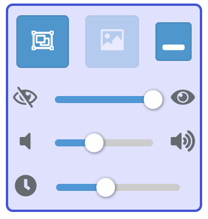

# ツールの使い方

## ツールについて

ルームから送信されたスタンプを、自分のデスクトップ画面上に表示するためのツールです。

## 動作環境

Windows 7以降

**但しWindows 7の場合はAeroを有効にしてあること。**

無効にしている場合はツールを使えません。この場合、配信者向けページに記載している別の方法をお試し下さい。

## 起動方法

ダウンロードした圧縮ファイルを解凍し、中にあるstampcast.exeを起動して下さい。

### マルチディスプレイ環境の場合

スタンプはどれか一つの画面にしか表示出来ません。ツールを起動する時は表示したいディスプレイの表示範囲の中にエクスプローラーウィンドウなどを移動してからツールを起動して下さい。

## ツール画面の説明

### 上部3つのボタン、左

**スタンプの表示領域指定ウィンドウのON/OFF**

送られてきたスタンプは、このウィンドウ領域のどこかに表示されます。ウィンドウはドラッグで場所を移動したり、リサイズで大きさを調整できます。

### 上部3つのボタン、中央

**スタンプの上限サイズ指定ウィンドウのON/OFF**

送られてきたスタンプは、このウィンドウをはみ出さない大きさにまで、アスペクト比を保ったままリサイズされ表示されます。このウィンドウより小さいスタンプに対しては何もしません。（ウィンドウと同じにまで大きくするという事はしない）

このウィンドウで指定するのは大きさのみで、場所はどこにあっても関係ありません。

スタンプの表示領域指定ウィンドウより大きいサイズにしないでください。表示領域外にまでスタンプがはみ出してしまいます。

### 上部3つのボタン、右

**コントロールパネルを折りたたむ**

再度クリックで元の大きさに戻ります。

### 3つのスライダー、上

**スタンプ透過度設定**

送られてきたスタンプの透過度を11段階で指定できます。一番左にすると非表示にできます。

### 3つのスライダー、中央

**スタンプ通知音ボリューム設定**

スタンプが送られてきた時に鳴るSEのボリュームを11段階で調整できます。一番左にするとミュートにできます。

### 3つのスライダー、下

**スタンプ表示時間設定**

スタンプが送られてきたあと、消えるまでの時間を0.5秒〜8秒の間で指定できます。デフォルトは3.5秒です。

## アンインストール

レジストリは使用していません。ダウンロードしたファイルを削除するだけです。